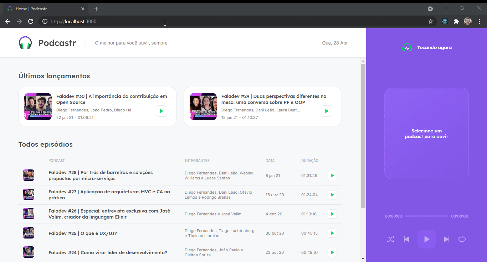

# PODCASTR

<h1 align="center">
    
</h1>

[](./README.md)

## Índice

- [🧾 Sobre o projeto](#-sobre-o-projeto)
- [🚀 Principais tecnologias utilizadas](#-principais-tecnologias-utilizadas)
- [🔽 Como baixar o projeto](#-como-baixar-o-projeto)
- [💻 Como executar o projeto](#-como-executar-o-projeto)
- [👌 Como usar o app](#-como-usar-o-app)
  <br>

## 🧾 Sobre o projeto

PODCASTR é uma aplicação podcast feita com ReactJS e NextJS. Nela você pode escutar os episódios listados em tela e ter todo o controle que você teria em um player de música. Alguns conceitos do NextJS foram aplicados nesse projeto: Server-side Rendering (SSR), Static Site Generation (SSG), API routes e File-system routes.
<br>

## 🚀 Principais tecnologias utilizadas

- [React](https://reactjs.org/)
- [NextJS](https://nextjs.org/)
- [Typescript](https://www.typescriptlang.org/)
- [Sass](https://sass-lang.com/)
- [JSON Server](https://github.com/typicode/json-server)

_(Você pode ver todas as dependências do projeto no arquivo [package.json](./package.json))_
<br>

## 🔽 Como baixar o projeto

```bash
$ git clone https://github.com/victorbadaro/podcastr
```

<br>

## 💻 Como executar o projeto

Os comandos abaixo usam o gerenciador de pacotes [yarn](https://yarnpkg.com/).

```bash
# 1. Instale as dependências do projeto
$ yarn

# 2. Execute a API do JSON Server
yarn server

# Você pode executar o projeto utilizando tanto o ambiente de desenvolvimento como também o de produção.

# Desenvolvimento:
yarn dev

# Para executar utilizando o ambiente de produção você deve primeiro realizar o build do projeto:
yarn build

# Após isso é só executar o projeto
yarn start
```

Se tudo for executado corretamente, uma mensagem será apresentada no terminal informando que o código da aplicação foi compilado com sucesso:

```bash
Compiled successfully
```

Agora basta abrir o navegador e acessar: http://localhost:3000/

✅ Pronto! Se você seguiu corretamente os passos acima o projejto já estará sendo executado localmente em tua máquina.
<br>

## 👌 Como usar o app

- Escolha um episódio da lista e clique em **play** para começar a ouví-lo. Você tamém pode clicar em cima do episódio para ver a página com os detalhes sobre ele:
  

<br>

---

<p align="center">Este projeto foi criado e desenvolvido com ❤ por <a href="https://github.com/victorbadaro">Victor Badaró</a></p>
